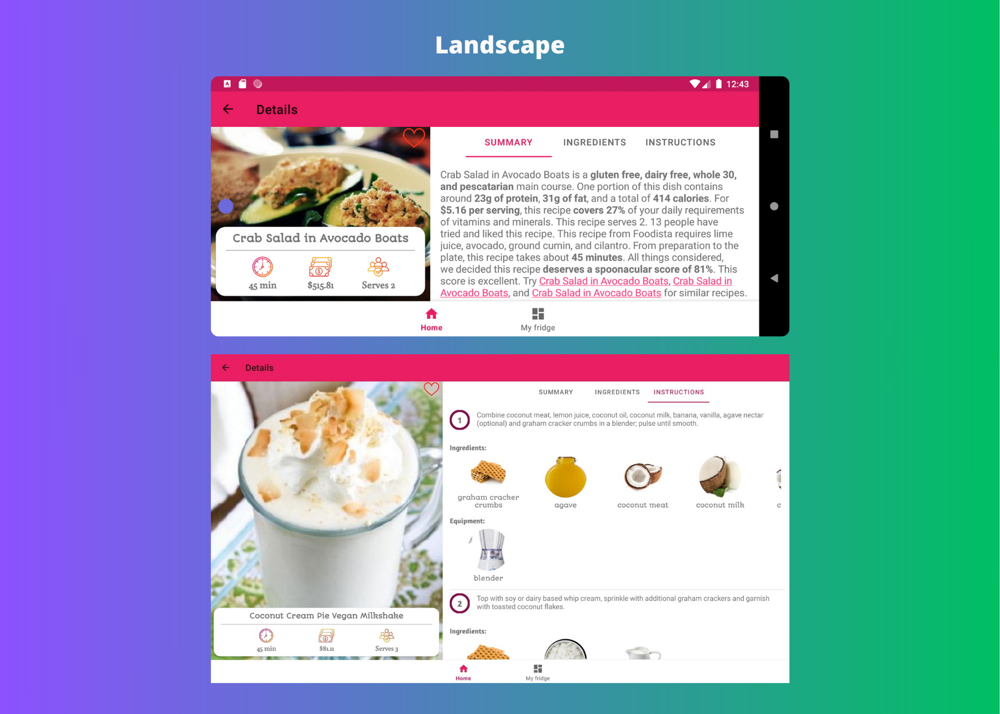
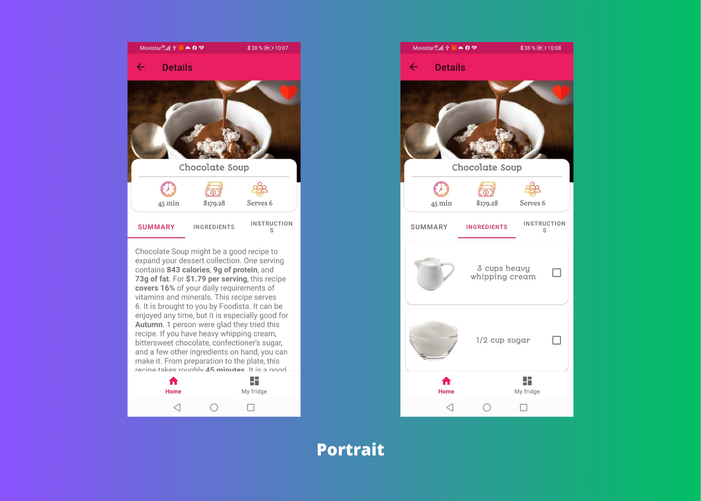
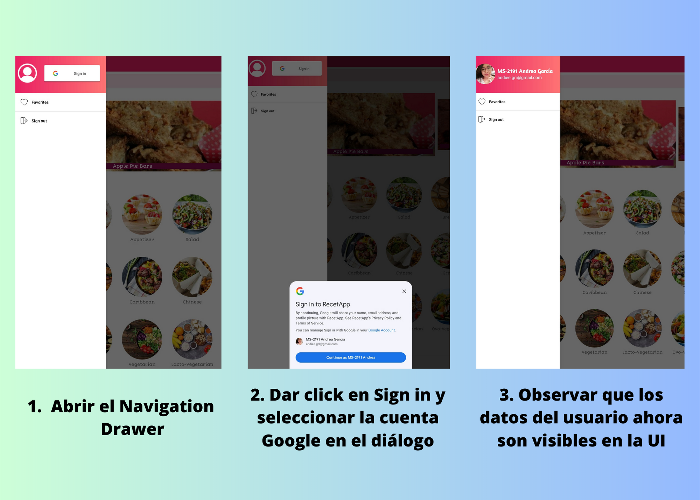
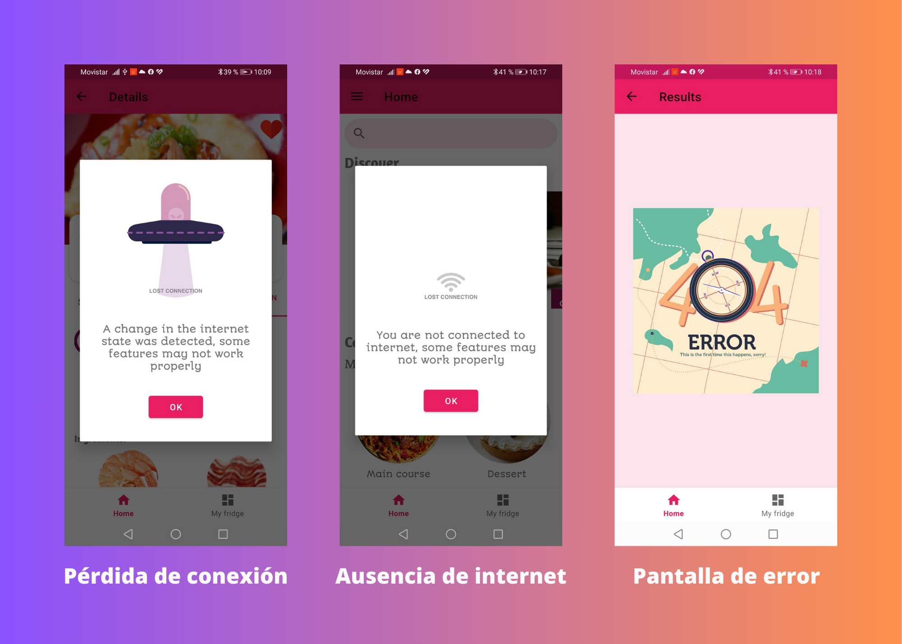

# RecetApp
## Objetivo
RecetApp tiene como objetivo poner una alimentación más sana y nutritiva al alcance de todos.

Nuestro ritmo de vida acelerado nos obliga a buscar opciones fáciles, sin embargo, la comida que está más a nuestro alcance suele tener un bajo contenido nutrimental. Además, algunas personas encuentran tedioso cocinar porque creen que es tardado y complicado, o no tienen las herramientas suficientes.

Es por ello que, la app proporcionará un punto de encuentro que motive a las personas a preparar sus propios alimentos mediante una aplicación móvil, la cual permitirá encontrar y compartir recetas a la medida, acorde a nuestro expertise y acceso a ingredientes.

## Descripción del logo
El logo de la aplicación muestra una piramide alimenticia y algunos alimentos saludables, haciendo referencia al objetivo de la app que pretende acercar a las personas a la cocina para mejorar su dieta.

## Justificación de la elección del tipo de dispositivo, versión del sistema operativo y las orientaciones soportadas.
La app está pensada para todo tipo de dispositivos aunque se recomienda el uso de tabletas para una mejor visualización del contenido, esto debido a, la gran cantidad de información que puede llegar a presentarse en pantalla. Teniendo esto en mente, la app puede utilizarse en modo landscape y todas las pantallas son responsivas.
{width=200px height=100px}

{width=200px height=100px}

El nivel mínimo de API es el 24, el cual equivale a Android Nougat y hace que la app este disponible para el 94.4% de los dispositivos. Se decidió de esta manera, ya que es posible que los dispositivos debajo de la versión mencionada no cuenten con los requerimientos de hardware adecuados, por ejemplo, el tamaño y resolución de pantalla

## Credenciales para poder acceder al app
La app implementa la autenticación por medio de Google One Tap, en donde es posible seleccionar una cuenta Google como medio de identificación, por lo que no se necesitan usuarios ni contraseñas. Para probar esta funcionalidad en la app, solamente es necesario seguir el siguiente flujo:

{width=200px height=100px}

## Dependencias del proyecto
- Material Design 1.8.0
- Constraint Layout 2.1.4
- Navigation component 2.5.3
- Dagger Hilt 2.44
- Retrofit2 2.7.2
- GSON 2.4.0
- Lottie 3.4.0
- Glide 4.15.0
- Firebase Auth 20.4.1
- Room 2.5.0
- Work Manager 2.8.0

## Preview

### Manejo de errores
{width=200px height=100px}

### Home

### What's in my fridge?

### Favorites
