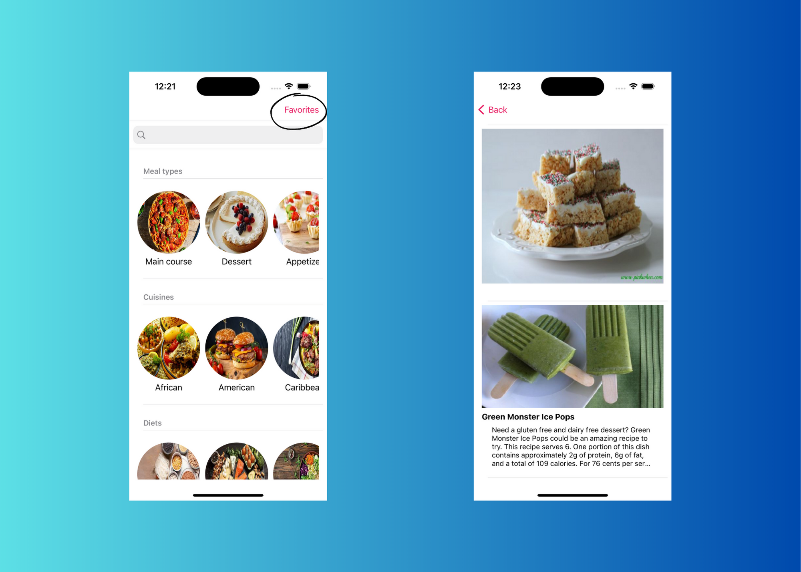

# RecetApp
## Objetivo
RecetApp tiene como objetivo poner una alimentación más sana y nutritiva al alcance de todos.

Nuestro ritmo de vida acelerado nos obliga a buscar opciones fáciles, sin embargo, la comida que está más a nuestro alcance suele tener un bajo contenido nutrimental. Además, algunas personas encuentran tedioso cocinar porque creen que es tardado y complicado, o no tienen las herramientas suficientes.

Es por ello que, la app proporcionará un punto de encuentro que motive a las personas a preparar sus propios alimentos mediante una aplicación móvil, la cual permitirá encontrar y compartir recetas a la medida, acorde a nuestro expertise y acceso a ingredientes.

## Descripción del logo
El logo de la aplicación muestra una piramide alimenticia y algunos alimentos saludables, haciendo referencia al objetivo de la app que pretende acercar a las personas a la cocina para mejorar su dieta.

## Justificación de la elección del tipo de dispositivo, versión del sistema operativo y las orientaciones soportadas.
La app está pensada para todo tipo de dispositivos aunque se recomienda el uso de tabletas para una mejor visualización del contenido, esto debido a, la gran cantidad de información que puede llegar a presentarse en pantalla. Teniendo esto en mente, la app puede utilizarse en modo landscape en todas las pantallas excepto la vista de detalle porque las instrucciones se cortan.

El minimum deployment ha sido definido en iOS 12.0, lo que significa que la app estará disponible en todos los dispositivos que soporten al menos esta versión de sistema operativo. Se decidió de esta manera para permitir un mayor alcance; debido a que la gama de dispositivos suele ser más limitada y costosa en iOS, es posible que algunos usuarios conserven sus dispositivos antiguos o no los cambien con tanta regularidad.

## Dependencias del proyecto
- Lottie
- FaveButton

El manejo de dependecias se realizó por medio de Carthage, así que será necesario seguir los siguientes pasos para ejecutar el proyecto:

1. Colocarse en la ubicación en la que se encuentra el archivo Cartfile

`cd Diplomado-Mobile-DGTIC/Project/iOS/RecetApp`

2. Ejecutar el siguiente comando

`carthage update --use-xcframeworks —platform iOS`

3. Al terminar la ejecución se creará una carpeta de nombre Carthage y dentro de ella la carpeta Build. Es necesario arrastrar el contenido de esta carpeta a la sección Framework, Libraries and Embedded Content

## Preview

### Splash Screen

### Manejo de errores

### Home

### Favorites

